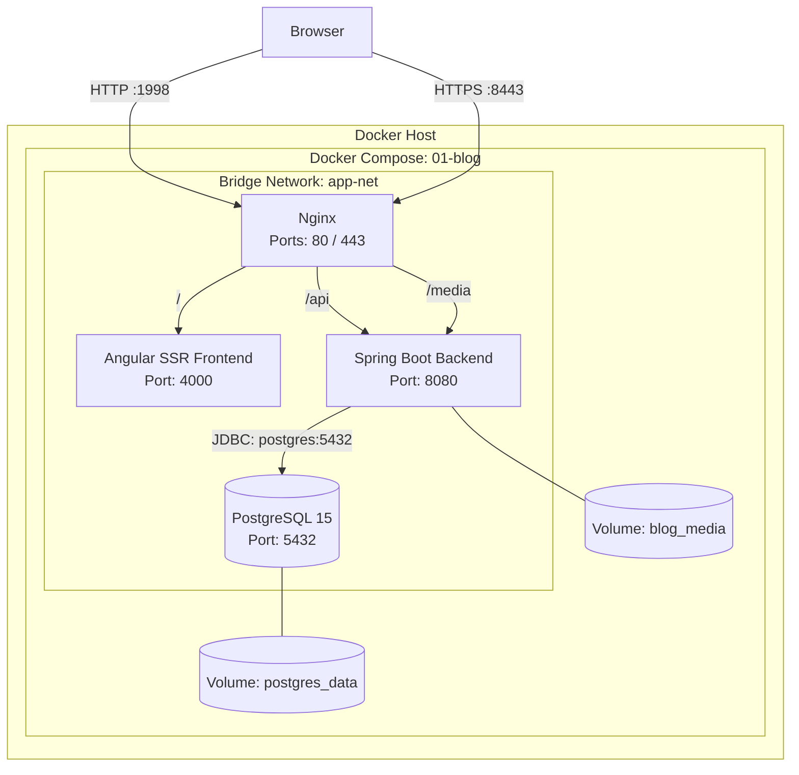

```mermaid

flowchart TB
    B["Browser"]

    subgraph HOST["Docker Host"]
        subgraph COMPOSE["Docker Compose: 01-blog"]
            subgraph NET["Bridge Network: app-net"]
                N["Nginx<br/>Ports: 80 / 443"]
                F["Angular SSR Frontend<br/>Port: 4000"]
                API["Spring Boot Backend<br/>Port: 8080"]
                DB[("PostgreSQL 15<br/>Port: 5432")]

                N -->|"/"| F
                N -->|"/api"| API
                N -->|"/media"| API
                API -->|"JDBC: postgres:5432"| DB
            end

            V1[("Volume: postgres_data")]
            V2[("Volume: blog_media")]

            DB --- V1
            API --- V2
        end
    end

    B -->|"HTTP :1998"| N
    B -->|"HTTPS :8443"| N
```